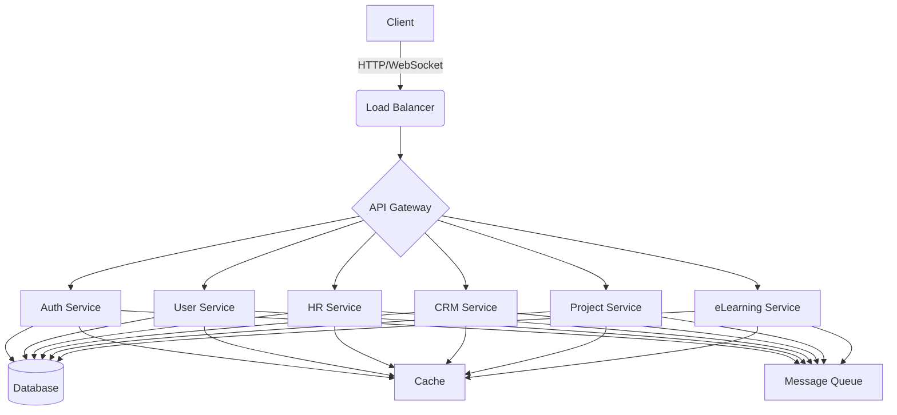

# Adminsuite Architecture Documentation

## 1. Project Overview

Adminsuite is a comprehensive management system designed to handle various aspects of organizational operations, including HR, CRM, project management, eLearning, and more. The system is built using a microservices architecture, with a Go backend, React frontend, and is deployable using Docker and Kubernetes.

## 2. Project Structure

```
adminsuite/
├── backend/
│   ├── cmd/
│   │   └── server/
│   │       └── main.go
│   ├── internal/
│   │   ├── auth/
│   │   ├── config/
│   │   ├── database/
│   │   ├── middleware/
│   │   ├── models/
│   │   ├── repositories/
│   │   ├── services/
│   │   └── utils/
│   ├── pkg/
│   │   ├── ai/
│   │   ├── cache/
│   │   ├── logger/
│   │   └── queue/
│   ├── api/
│   │   ├── handlers/
│   │   ├── routes/
│   │   └── middleware/
│   ├── migrations/
│   ├── scripts/
│   └── tests/
├── frontend/
│   ├── public/
│   ├── src/
│   │   ├── components/
│   │   ├── pages/
│   │   ├── hooks/
│   │   ├── utils/
│   │   ├── styles/
│   │   ├── context/
│   │   └── api/
│   ├── next.config.js
│   └── package.json
├── mobile/
│   ├── android/
│   ├── ios/
│   └── src/
│       ├── components/
│       ├── screens/
│       ├── hooks/
│       ├── utils/
│       └── api/
├── desktop/
│   ├── frontend/
│   └── backend/
├── shared/
│   ├── types/
│   └── utils/
├── docs/
│   ├── api/
│   ├── architecture/
│   └── user-guides/
├── deploy/
│   ├── kubernetes/
│   ├── docker/
│   └── scripts/
├── .github/
│   └── workflows/
├── .gitignore
└── README.md
```

## 3. Component Descriptions

### 3.1 Backend

The backend is built using Go and follows a clean architecture pattern.

- `cmd/`: Contains the main entry point for the application.
- `internal/`: Houses the core business logic and application-specific code.
- `pkg/`: Includes reusable packages that could potentially be externalized.
- `api/`: Defines the API routes, handlers, and middleware.
- `migrations/`: Contains database migration scripts.
- `scripts/`: Includes utility scripts for development and deployment.
- `tests/`: Houses all test files for the backend.

### 3.2 Frontend

The frontend is built using React with Next.js for server-side rendering capabilities.

- `public/`: Contains static assets.
- `src/`: Houses the main source code for the frontend.
  - `components/`: Reusable React components.
  - `pages/`: Next.js pages for routing.
  - `hooks/`: Custom React hooks.
  - `utils/`: Utility functions.
  - `styles/`: CSS and style-related files.
  - `context/`: React context providers.
  - `api/`: API client and related utilities.

### 3.3 Mobile

The mobile application is built using React Native.

- `android/` and `ios/`: Native code for respective platforms.
- `src/`: Cross-platform JavaScript code.

### 3.4 Desktop

The desktop application is built using Wails, combining Go backend with React frontend.

### 3.5 Shared

Contains shared types and utilities used across different parts of the application.

### 3.6 Docs

Houses all project documentation.

### 3.7 Deploy

Contains deployment-related configurations and scripts.

- `kubernetes/`: Kubernetes configuration files.
- `docker/`: Dockerfiles and Docker Compose files.
- `scripts/`: Deployment and infrastructure management scripts.

## 4. Key Technologies

- Backend: Go 1.22, Gin web framework
- Frontend: React 18, Next.js 14
- Database: PostgreSQL 14
- Caching: Dragonfly (Redis-compatible)
- Message Broker: RabbitMQ
- Container Orchestration: Kubernetes
- CI/CD: GitHub Actions

## 5. Architecture Diagram



## 6. Deployment Strategy

Adminsuite uses a containerized deployment strategy with Kubernetes for orchestration. The application is designed to be cloud-agnostic and can be deployed on any Kubernetes-compatible cloud platform or on-premises infrastructure.

Key aspects of the deployment:

- Microservices are individually containerized and deployed as Kubernetes pods.
- Horizontal Pod Autoscaler (HPA) is used for automatic scaling based on CPU and memory usage.
- Persistent data is stored in managed database services or stateful sets for on-premises deployments.
- Secrets and configuration are managed using Kubernetes Secrets and ConfigMaps.
- Ingress controllers manage external access to the services.

## 7. Security Considerations

- All external communication is encrypted using TLS.
- Authentication is handled using JSON Web Tokens (JWT) with regular key rotation.
- Authorization is implemented using Role-Based Access Control (RBAC).
- Regular security audits and penetration testing are conducted.
- All sensitive data is encrypted at rest and in transit.

## 8. Monitoring and Logging

- Prometheus is used for metrics collection.
- Grafana dashboards provide visualization of system and business metrics.
- ELK stack (Elasticsearch, Logstash, Kibana) is used for centralized logging.
- Alerting is configured for critical system events and performance thresholds.

## 9. Future Considerations

- Implementation of a service mesh (e.g., Istio) for advanced traffic management and security features.
- Exploration of serverless architectures for specific microservices to optimize resource usage and costs.
- Integration of machine learning models for predictive analytics and automated decision-making.
